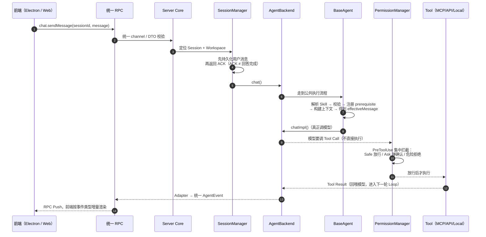
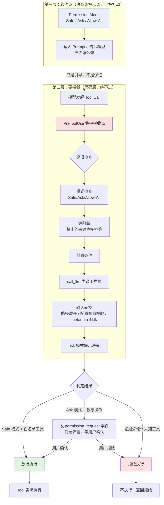
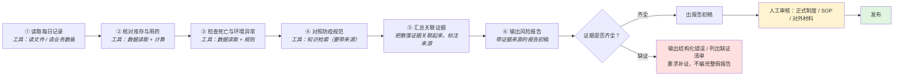
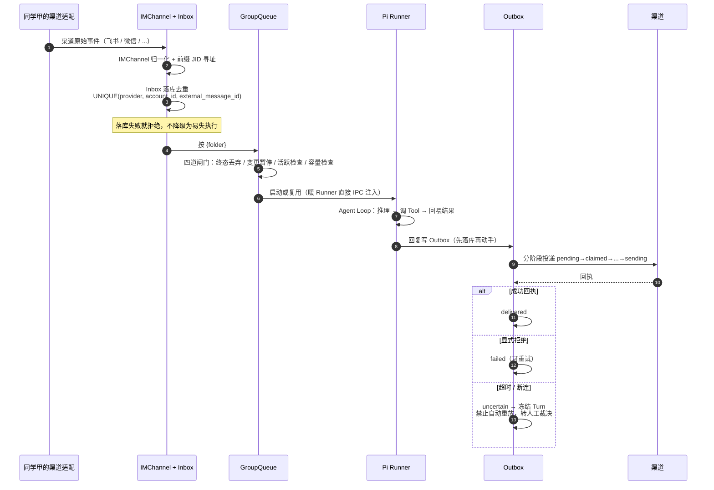
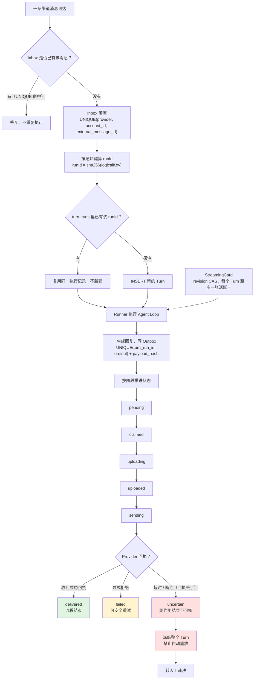
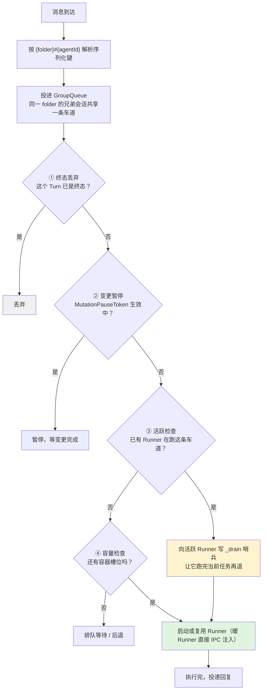

# 项目面试复习总纲

> 对应简历两个项目：**蓬蓬AI · 养殖场合规与异常审查 Agent（梵域·八戒农牧）** + **多渠道获客数字员工平台（辰创）**
> 两个项目是同一条主线的两次演练：**行业场景的合规判断**（梵域·养殖）与**多渠道对客的可靠性执行**（辰创·销售）。
> 回答统一四段式：**解决什么问题 → 怎么实现 → 为什么这样设计 → 局限与扩展**。
> 口径来源：`简历/小石_Agent开发_Skill场景版.md`（最新）；选点总台 `16`；旧"内容生产端↔承接端"闭环叙事已停用。

---

# 实习总览：两家企业实习 · 完整交付

> 辰创（2026.02–04 · 多渠道获客）→ 梵域（2026.05–08 · 八戒农牧养殖场合规审查）。两个 Agent 应用端由我负责，一次练**横向的可靠性执行**，一次练**纵向的行业深度**，串成"接入、执行、控险、稳跑"的完整闭环。

**贯穿一句话：** 不是只把模型接进来，而是把 Agent 放进真实业务流程——怎么接入、怎么执行、怎么控风险、怎么稳定运行。

## 实习高频拷打

**Q：先一句话讲两段实习的关系？**
> 同一条主线的两次演练——先在深圳辰创做多渠道获客数字员工（7 类 IM，练"多人、多渠道怎么不重不丢、不越权"），后到杭州梵域做养殖场合规与异常审查 Agent（落地农牧企业八戒农牧，练"行业 SOP 怎么变成可执行、可观察、可回归的 Agent 能力"）。一次是横向的可靠性执行，一次是纵向的行业深度。口径：两段都是企业实习交付，应用端由我负责；执行底座复用成熟开源/可嵌入 Harness（Pi 一类），不升格。**两段独立，不虚构共享数据库或上下游衔接。**

**Q：两段实习怎么分工的？团队里你负责什么？**
> 辰创——多渠道获客：渠道接入、三层身份模型、四账本可靠性、串行调度、画像沉淀，由我负责；梵域——养殖场合规审查（八戒农牧）：异常审查 SOP 骨架、工具接入层、权限硬拦截、多后端适配、上下文装配、Eval 回归，由我负责。小团队交付，带教把关客户对接与架构评审（【模拟设定，A3 核实】）。
> 追问"实习生为什么能负责两个应用端"：小团队/小公司场景下应用端交付就是一个人扛——渠道适配、可靠性与权限这些"非模型"工程正是我的主战场；执行循环等成熟能力复用底座，把精力放在业务边界上。

**Q：实习期间遇到的最大技术难点？**
> 首选（梵域）多端行为不一致：同一个错误 Web 能自动恢复、桌面端直接白屏——排查三步（复现 → 对比链路发现前端 API/IPC/后端 handler 各自演进已漂移 → 根因是事件无统一契约），修复用 AgentEvent 可辨识联合 + 契约测试进 CI。次选（辰创）多智能体会话污染：三层隔离 + 串行队列 + 双 revision 乐观锁。讲真事故，STAR 结构，复盘收获收尾。

**Q：八戒农牧这个客户，你具体交付了什么？**
> 蓬蓬AI 养殖场合规与异常审查 Agent：把用药、防疫、消毒、死亡、环境记录串成"读取记录→核对库存与用药→检查死亡和环境异常→对照防疫规范→汇总关联证据→输出风险报告"的审查 Workflow；沉淀查/算/写/讲 4 类任务 × 6 类部门共 72 个工作模板，形成生物安全、成本分析、生产复盘、政府申报等成果样例。场景举例：Agent 按当日记录核对库存与用药、比对防疫规范，输出带证据来源的风险报告初稿；正式制度与对外材料需人工审核后发布。使用规模按 00 A1/A2 口径，不编。
> 追问"72 个模板什么概念"：编码规则=功能（查/算/写/讲）× 部门（R1 经营管理~R6 生产）× 序号，4×6×3=72，每个有场景定位/典型输入/典型输出。

**Q：两段实习的技术能力怎么递进？**
> 辰创（先）："多人/多渠道怎么可靠"——IMChannel 统一渠道契约、四账本 + runId fencing、ACL 权限矩阵、/pair 绑定 + 信任阶梯。梵域（后）："行业 SOP 怎么变成能力"——BaseAgent 异常审查骨架、MCP/API/本地数据统一工具契约、Safe/Ask/Allow-All + PreToolUse 硬拦截、AgentBackend + AgentEvent、Event Trace + 契约测试 Bad Case 回归。主线：横向的可靠性 → 纵向的行业深度 →「接入、执行、控险、稳跑」完整闭环。

---

# 项目一：蓬蓬AI · 养殖场合规与异常审查 Agent（杭州梵域 · 八戒农牧）

> 源码：craft-agents-oss-main ｜ 技术栈：TypeScript / React / Electron / WebSocket / Hono / AgentBackend / MCP / SQLite / 契约测试
> ⚠️ 下面的**源码级机制**（Harness / AgentBackend / AgentEvent / 权限 / MCP / 契约测试）继续有效；**叙事外壳**已从"多端内容助手"换成"养殖场合规与异常审查 Agent"。

## 1.1 项目定位与五个核心选点

**业务问题：** 八戒农牧的用药、防疫、消毒、死亡、环境记录分散在制度文件与现场资料里，现场问题依赖人工交叉核查，效率低且易漏；多岗位产出与行业知识分散；不同模型后端与桌面/Web 端行为易漂移；敏感操作缺硬边界；Agent 行为缺可回归的验证。

**目标：** 把高频岗位工作转成可复用的 Agent 工作模板；让模型能按任务调用证据，同时保证敏感操作可控、会话互不污染、行为可复现可回归。

**五个核心选点（与简历 b1–b5 一一对应）：**

| 选点 | 核心方案 | 关键模块 |
|---|---|---|
| ① 养殖知识与 MCP Tools | MCP/API/本地数据源 → 统一工具契约（注册/凭据注入/结果回传） | 能力接入层 / ServerBuilder / McpClientPool |
| ② Agent Harness / 异常审查 SOP | 六步审查流程 + BaseAgent 生命周期统一技能解析/上下文注入/工具编排 | BaseAgent / Workflow |
| ③ Tool Calling / 人工审批 | Safe/Ask/Allow-All 三档 + PreToolUse 集中硬拦截 | PermissionManager / PreToolUse |
| ④ 多后端与上下文工程 | AgentBackend 统一契约 + AgentEvent 可辨识联合 + Session/Workspace 隔离 | AgentBackend / Adapter / Session |
| ⑤ Agent Eval / Bad Case 回归 | Event Trace 可回放 + Channel Map 契约测试 + 工具冒烟用例 | Contract Test / Trace |

---

## 1.2 整体架构

```text
                    React UI
                 /            \
           Electron           Web
              \              /
               Unified RPC
          （统一 channel / DTO / routing）
                    │
                    ▼
               server-core
          ┌─────────┼─────────┐
          ▼         ▼         ▼
      Session   Permission  AgentBackend
     Workspace   Manager     （统一契约）
          │         │           │
          │         │     ┌─────┴─────┐
          │         │     ▼           ▼
          │         │  ClaudeAgent  PiAgent
          │         │     │           │
          │         │  Claude SDK  Pi/子进程
          │         │     │           │
          │         │     └─────┬─────┘
          │         │           ▼
          │         │        Adapter
          │         │           ▼
          │         │       AgentEvent
          │         │           │
          ▼         ▼           ▼
      Tools / MCP / API / Local（外部能力）
                    │
                    ▼
              McpClientPool
          （连接/Discovery/Cache/Routing）
```

**核心设计思想：把变化隔离在边界里，把稳定能力统一成接口。**

```text
模型差异(Claude/Pi) → AgentBackend+Adapter → 统一 Runtime 接口/AgentEvent
客户端差异(Electron/Web) → RPC → 统一通信
外部能力差异(MCP/API/Local) → Source/Tool/Pool → 统一 Agent Tool
执行风险(Tool Call) → PermissionManager → Allow/Ask/Deny
```

---

## 1.3 一条消息进来的完整执行流程（面试重点）

> **面试官问："用户输入'读取今天猪场的每日记录、核对库存与用药、生成一份异常风险报告'，从点击发送到看到最终结果，整个流程是怎么跑的？"**

### 完整链路（按源码实际执行顺序）

```text
【第1步】UI 发起请求
  React UI（Electron 或 Web）→ rpc.invoke("chat.sendMessage", { sessionId, message })
  → 统一 RPC channel，Electron 走 IPC、Web 走 WebSocket，上层不感知传输差异

【第2步】RPC 路由到 Server Core
  统一 DTO 校验 → Server Core 接收
  → SessionManager 定位 Session（按 sessionId）
  → 确认 Workspace 工作目录与配置

【第3步】持久化用户消息（可靠性）
  push userMessage 到会话历史
  → persistSession() 持久化到 SQLite
  → flushSession() 刷盘
  → 返回 ACK / accepted 给客户端
  → 注意：ACK 的含义是消息已可靠接收并持久化，不是模型已完成回答

【第4步】AgentBackend 调度
  SessionManager → AgentBackend.chat()
  → AgentBackend 是面向上层的统一契约，上层不关心具体是 Claude 还是 Pi
  → 路由到对应 Backend 实例（ClaudeAgent / PiAgent）

【第5步】BaseAgent 公共执行流程（Template Method）
  BaseAgent.chat() 已实现公共执行骨架，不是空接口：
  ① 解析 Skill
  ② Skill 校验
  ③ 注册 prerequisite
  ④ 构建 branch / transferred context
  ⑤ 构建 Skill directive
  ⑥ 得到 effectiveMessage
  ⑦ → 调用 chatImpl()（由具体 Agent 子类实现）

【第6步】模型推理（Claude / Pi）——以"读取每日记录 / 核对库存用药 / 生成风险报告"为例：模型先决定读哪些记录、调哪些工具，而不是直接凭记忆下结论
  ClaudeAgent：直接调 Claude SDK
  PiAgent：子进程 JSONL 通信 + 工具代理回主进程
  → 模型开始流式生成，同时决定是否需要调用 Tool

【第7步】Tool Call 决策（Agent Loop）
  模型判断：需要读取文件 → 发起 Tool Call（read_file）
  → Tool Call 不直接执行，先经过权限层

【第8步】PermissionManager 集中硬拦截
  Tool Call → PreToolUse 集中拦截点
  → PermissionManager 判定（当前 Session permission mode + Tool Name + Tool Input + 权限策略）
  → 三种结果：
     • Safe 模式 + 白名单工具 → Allow，直接执行
     • Ask 模式 + 敏感操作 → 发 permission_request 事件，等用户确认
     • 明确危险 / 未知工具 → Deny，拒绝执行
  → 核心原则：模型决定"想做什么"，PermissionManager 决定"系统允许做什么"
  → Prompt 是软约束，代码层硬拦截才是安全边界

【第9步】Ask 模式的用户确认回环
  PermissionManager → permission_request 事件
  → Adapter → AgentEvent(permission_request)
  → RPC Push → 前端渲染确认弹窗
  → 用户点击确认 → rpc.invoke("permission.resolve", { allow: true })
  → RPC → PermissionManager 收到确认 → 放行 Tool 执行

【第10步】Tool 实际执行
  Allow 后 → Tool Execute
  → Tool 可能来自：
     • MCP Server（经 McpClientPool 路由）
     • API（经 API Tool Adapter）
     • Local（本地文件/命令）
  → McpClientPool 统一管理：连接生命周期 / Tool Discovery / Cache / Proxy Tool 映射 / Routing
  → Proxy Tool Name：mcp__{sourceSlug}__{toolName}，加 Source namespace 避免同名冲突
  → Tool 执行完成 → Tool Result

【第11步】Tool Result 回模型（Agent Loop 关键回环）
  Tool Result → 重新喂给模型
  → 模型基于工具结果继续推理
  → 判断是否还需要其他 Tool
  → 需要 → 回到第7步（循环）
  → 不需要 → 继续生成最终文案

【第12步】流式输出与事件转换
  模型输出（文本增量 / 工具启停 / 权限请求 / 错误 / 完成）
  → Provider 原始事件（Claude SDK 事件 / Pi 子进程 JSONL 事件）
  → 对应 Adapter（ClaudeEventAdapter / PiEventAdapter）
  → 转换成统一 AgentEvent（可辨识联合类型）：
     • status / text_delta / text_complete
     • tool_start / tool_result
     • permission_request
     • error / complete

【第13步】RPC Push 到前端
  AgentEvent → RPC Push（事件推送通道）
  → Electron 走 IPC push、Web 走 WebSocket push
  → 前端统一消费 AgentEvent，增量渲染：
     • text_delta → 打字机效果追加文本
     • tool_start → 显示"正在调用工具"
     • tool_result → 显示工具返回结果
     • complete → 标记回答完成

【第14步】完成与会话状态更新
  AgentEvent(complete) → 前端标记完成
  → 服务端更新 Session 状态、持久化完整对话
  → 整条消息链路结束
```

### 关键回环（必须讲清楚）

```text
Tool Result
   ↓
Model 继续推理
   ↓
是否还需要 Tool？
 ├── 是 → 再调用 Tool → PermissionManager → Tool Execute → Tool Result（循环）
 └── 否 → 最终输出 → Adapter → AgentEvent → RPC Push → UI
```



> 看图要点：**"先持久化再返回 ACK"和第 10 步"Tool Call 不直接执行"是两道关**——前者保证消息不丢，后者保证模型不能越过系统。
> 现场讲这条链路时，按"接入 → 执行 → 控险 → 回传"四段说，不要平铺 14 步。

### 面试精简版回答（30 秒）

> "比如用户让 Agent 读取今天猪场的每日记录、核对库存与用药、出一份异常风险报告：首先通过统一 RPC 调用——Electron 走 IPC、Web 走 WebSocket，但上面是一套统一的 channel 和 DTO。RPC 到 Server Core 后，SessionManager 定位会话，先把用户消息持久化到 SQLite 再返回 ACK——ACK 只代表消息已可靠接收，不代表回答完成。然后 AgentBackend.chat() 调度到具体后端，BaseAgent 先走公共执行流程（Skill 解析、上下文构建），再调 chatImpl() 进入 Claude 或 Pi。模型推理中如果需要调工具，Tool Call 不会直接执行，而是先经过 PermissionManager 的 PreToolUse 硬拦截——Safe 模式白名单放行、Ask 模式弹确认框、危险操作直接拒绝。放行后工具经 McpClientPool 路由到 MCP/API/Local 执行，Tool Result 回喂给模型继续推理，这就是 Agent Loop。整个过程中，Provider 原始事件经 Adapter 转成统一 AgentEvent，再通过 RPC Push 推到前端做增量渲染。"

---

## 1.4 核心模块详解

### 1.4.1 AgentBackend + BaseAgent

**AgentBackend = 统一契约**，定义上层稳定调用接口：
```text
chat() / abort() / forceAbort() / redirect() / runMiniCompletion() / destroy() / postInit()
```

**BaseAgent = 公共实现**，收敛不同 Backend 共有能力：
- Session / workspace 状态
- PermissionManager
- Source 管理
- PromptBuilder
- Skill 处理
- Usage Tracking
- 配置监听

**三者关系：**
```text
AgentBackend = 统一契约
BaseAgent    = 公共实现（Template Method 思想）
具体 Agent   = Provider 差异（ClaudeAgent / PiAgent）
```

**BaseAgent.chat() 不是空接口**，已实现公共执行流程：
解析 Skill → Skill 校验 → 注册 prerequisite → 构建 branch/context → 构建 Skill directive → effectiveMessage → chatImpl()

### 1.4.2 Adapter + AgentEvent

**为什么需要 Adapter：** Claude / Pi 原始事件格式不同，如果每个客户端各自适配，会有 4 套适配代码（Claude→Web、Claude→Electron、Pi→Web、Pi→Electron）。正确做法是 Provider 事件 → Adapter → 统一 AgentEvent → UI。

**AgentEvent = 项目内部统一的 Agent 事件模型**（可辨识联合类型）：
```text
status / text_delta / text_complete
tool_start / tool_result
permission_request
error / complete
```



```mermaid
flowchart LR
    subgraph SRC["各自的原始事件（形状不同）"]
        C["Claude SDK 事件"]
        P["Pi 子进程<br/>JSONL 事件"]
    end

    SRC --> AD["Adapter 适配层<br/>ClaudeEventAdapter / PiEventAdapter"]

    AD --> EV["统一 AgentEvent<br/>可辨识联合类型"]

    subgraph TYPES["八种事件（类型封闭，编译期穷尽）"]
        E1["status"]
        E2["text_delta / text_complete"]
        E3["tool_start / tool_result"]
        E4["permission_request"]
        E5["error / complete"]
    end

    EV --> TYPES
    TYPES --> RPC["RPC Push<br/>（传输载体：IPC / WebSocket）"]
    RPC --> UI["Electron 渲染"]
    RPC --> UI2["Web 渲染"]
    UI -.->|"同一套 switch 穷尽处理"| UI2

    style AD fill:#fff3d0
    style EV fill:#e0f5e0
```

> 看图要点：**左边"形状不同"、右边"形状统一"**——统一的是**事件语义**，不是传输方式。
> 一句话区分：**AgentEvent 管"事件长什么样"，RPC 管"怎么送过去"**（这两者被问到必须分开答）。

**AgentEvent vs RPC（不要混淆）：**
- AgentEvent = 事件长什么样（事件模型）
- RPC = 客户端和服务端怎么通信（通信载体）
- 关系：Provider → Adapter → AgentEvent → RPC Push → Web/Electron

### 1.4.3 RPC 多端统一

**为什么需要统一 RPC：** Electron IPC 和 Web WebSocket 如果分别维护两套业务逻辑，事件格式一漂移两边渲染就不一致。

**统一的是业务协议不是传输技术：**
- 统一 channel / DTO / routing
- 只替换传输实现（IPC ↔ WebSocket）
- 业务逻辑只写一份，双端天然一致

**Web 端不能直接复用的能力：** Node/本地文件系统等 Electron 原生能力，需要通过服务端代理或适配器承接。

### 1.4.4 Session / Workspace 隔离

| 概念 | 含义 | 包含 |
|---|---|---|
| Session | 一次对话 + 工具执行状态 | conversation / tool execution / current agent state |
| Workspace | Session 运行的环境 | working directory / config / sources / preferences |

关系：一个 Workspace 可以有多个 Session。

**高危边界：这不是多租户隔离。** Session/Workspace 是运行态和工作目录隔离，严格的 SaaS 多租户还需要 tenant_id、数据库行级隔离或 RLS，不属于这个模块的边界。

### 1.4.5 PermissionManager 权限

**为什么不能只靠 Prompt：** Prompt 是软约束，模型可能判断错误、忽略规则、受上下文污染或 Prompt Injection 影响。真正的安全边界在工具执行前的代码层硬拦截。

**三种模式：**
- **Safe**：已知安全/只读操作放行，敏感/危险操作拦截
- **Ask**：Tool Call → PermissionManager → permission_request → 前端 → 用户确认 → 放行
- **Allow-All**：明确受信场景下减少交互式确认，提高连续执行效率。**注意：这是降低限制的运行档位，不是安全能力。**



> 看图要点：**上层是"告诉模型应该怎么做"，下层是"系统允许它做什么"**——两层都画出来，才答得住"为什么提示词不能当安全边界"。
> 一句话收口：**模型负责提议，系统负责裁决**。

**权限判断依据：** 当前 Session permission mode + Tool Name + Tool Input + 权限策略/Allowlist。对 Bash 还要分析 command 内容（管道、重定向、命令替换、潜在危险命令），不能只看 toolName==="Bash"。

**未知 Tool 默认策略：Fail Closed**，未知能力默认不能直接获得执行权限。

### 1.4.6 MCP / API / Local 统一接入 + McpClientPool

**Tool vs MCP 的区别：**
- Tool = Agent 可以调用的具体能力（read_file / search_issue 等）
- MCP = 标准化暴露和调用外部能力的一套协议
- 关系：MCP Server → Tools → MCP Client → Agent Runtime

**MCP vs Function Calling：**
- Function Calling = 模型如何表达"我要调用某个函数"（调用意图表达）
- MCP = 外部能力如何被标准化发现、描述、连接和调用（外部能力标准化接入）

**McpClientPool 集中承担：**
- Client 连接生命周期
- Source 配置
- Tool Discovery
- Tool Cache
- Proxy Tool 映射
- Tool Call Routing
- Source 动态同步

**为什么不让每个 Agent 自己维护 MCP：** 否则 ClaudeAgent 和 PiAgent 各做一套连接管理、认证、Discovery、Routing。统一 Pool 后不同 Backend 共用一条外部能力管理路径。

**Proxy Tool Name：** `mcp__{sourceSlug}__{toolName}`，给 Tool 加 Source namespace，避免多个 MCP Server 存在同名工具时冲突。对外兼容，内部保留原始 Tool 语义。

### 1.4.7 养殖合规审查 SOP（业务骨架，面试必讲）

**为什么要有这一层：** 养殖知识、业务数据和岗位方法原本散在制度文件与现场资料里，每个岗位各写一套大 Prompt 会重复流程/工具/失败分支，还容易漏掉关键核查步骤。



> 看图要点：六步里**只有第④步是"查知识"**、其他几步是"查数据 + 算 / 比对"——所以知识必须做成可检索、带来源的工具，不能塞进 Prompt。
> 右侧那两个分支是**合规场景的命门**：证据不全就停，正式材料必须过人工。

**六步审查链路（SOP → 可执行步骤）：**

```text
① 读取每日记录        读当天生产/防疫/消毒/死亡等记录（工具：读文件 / 读业务数据）
② 核对库存与用药      交叉比对用药记录与库存消耗（工具：数据读取 + 计算）
③ 检查死亡与环境异常  识别死亡率、环境指标的异常偏离（工具：数据读取 + 规则）
④ 对照防疫规范        与防疫流程/生物安全规范逐条比对（工具：知识检索）
⑤ 汇总关联证据        把散落的证据关联起来，标注来源
⑥ 输出风险报告        生成带证据来源的风险报告初稿（正式材料需人工审核）
```

**为什么能复用：** 六步是"通用骨架"，6 类部门 72 个岗位模板只换模板、领域资料和工具组合，执行骨架（技能解析 / 前置条件 / 上下文注入 / 消息重写）由 `BaseAgent` 统一。

**边界：** `AGENTS.md` 是声明性工作规则，不是独立 Workflow 引擎；缺证时输出结构化错误或要求补证，不继续编完整假报告。

### 1.4.8 Contract Test 契约测试

**什么是接口漂移：** 后端 `createSession({workspaceId})` 改成 `createSession({workspace_id})`，前端没同步，运行时才发现。

**为什么这个项目特别需要：** 存在 Web / Electron / Server / Agent Runtime 多端，如果各自维护协议定义就容易漂移。

**做法：** Shared Contract → Web/Electron/Server 共用 → Contract Test → Fail/Pass。目标是开发期发现协议不一致，而不是运行时才发现。

**共享 TypeScript 类型不等于完整运行时保证：** TypeScript 偏编译期，网络数据发生在运行时。更完整的是 Shared Contract + Runtime Validation + Contract Test。

### 1.4.9 Agent Eval / Bad Case 回归

**为什么只测函数返回值不够：** 判断不了 Agent 是否正确完成工具调用、权限判断、事件收尾，也判断不了合规审查 SOP 有没有走完。

**做了什么：**

| 手段 | 作用 | 覆盖的 Bad Case |
|---|---|---|
| Event Trace（文本/工具/权限/错误/完成可回放） | 定位证据：哪一步偏离 | 全部失败模式定位用 |
| Channel Map 契约测试 | 回归门禁：接口/事件顺序不漂移 | 多端一致性 |
| 工具冒烟用例 | 端到端可用性 | 库存与用药不一致 / 防疫记录缺失 / 异常死亡 / 环境变化未触发提示 |

**评测逻辑：** 先验证事件顺序、工具契约、权限路径、错误收尾和多端一致性，再检查业务 SOP 是否完整走完。

**边界（必说）：** 实现的是**确定性 Trace + 契约断言 + 冒烟测试**，**不是 LLM-as-a-Judge**，也没有虚构准确率或生产收益；行业 Gold/Bad/Ambiguous Dataset 是扩展方向。

**面试讲法：** "先评测可确定行为，不急着让另一个模型打分；事件序列可回放，就能定位是模型、工具还是协议引入回归。"

---

## 1.5 面试高频 Q&A

**Q：为什么只有 Claude 也值得抽象 AgentBackend？**
> 当前只有 Claude 不代表以后永远只有 Claude。这个项目是 Agent 平台型架构，提前把稳定的上层调用方式和 Provider 相关实现拆开。新增模型时主要增加对应 Backend，而不是把模型 SDK 的差异扩散到业务层和 UI。不是为了抽象而抽象，而是项目存在明确的多 Backend 需求。

**Q：AgentBackend 和 BaseAgent 有什么区别？**
> AgentBackend 是统一契约（定义接口），BaseAgent 是公共实现（收敛共有能力和执行流程，Template Method 思想），具体 Agent 是 Provider 差异。这样避免接口与实现过度耦合、Claude/Pi 重复实现公共逻辑、Provider-specific 代码污染公共能力。

**Q：为什么 Agent 输出要建模成事件流而不是返回字符串？**
> Agent 不是简单的字符串生成器。真实执行过程会启动工具、返回工具结果、请求权限、报错、结束。如果只有 Promise<string>，前端无法知道中间状态。所以建模成 text/tool/permission/error/done 各一种可辨识联合事件，UI 可以实时渲染，出错时也有明确的恢复路径。

**Q：为什么不能只靠 Prompt 限制工具？**
> Prompt 是软约束，模型可能判断错误、忽略规则、受上下文污染或 Prompt Injection 影响。真正的安全边界是工具执行前的代码层硬拦截——PreToolUse 集中点 + PermissionManager。模型决定"想做什么"，PermissionManager 决定"系统允许做什么"。模型可以用措辞骗人，但绕不过代码层的闸。

**Q：MCP 解决什么问题？为什么需要 McpClientPool？**
> MCP 解决 Agent 与外部能力之间的标准化接入问题，让 Agent 以标准化方式接入外部能力，不需要为每个系统写完全不同的接入路径。McpClientPool 把连接、Discovery、Cache、Routing 从 Agent 中剥离，让不同 Backend 共用一条外部能力管理路径，而不是每个 Agent 自己维护一套 MCP 连接和认证。

**Q：WebSocket 断线后为什么不能简单重发原始消息？**
> 客户端没收到结果 ≠ 服务端没执行。假设 Agent 已经执行了 write_file() 但客户端没收到结果，重新发送会导致重复 Tool Call、重复文件写入、重复 API 调用。恢复的重点是通信状态 + 事件状态（seq / lastSeenSeq / reconnect / ack），而不是盲目重跑整个 Agent。

**Q：养殖合规审查怎么保证不漏关键步骤？**
> 把 SOP 固化成六步链路（读取记录→核对库存用药→检查死亡环境→对照防疫规范→汇总证据→出风险报告），每步都有输入、工具、输出和失败处理；关键步骤靠工具调用和事件状态约束，而不是靠模型自觉。缺证据时输出结构化错误或要求补证，不继续编一份完整假报告。**边界**：Agent 出的是风险报告初稿，最终判断仍要兽医或管理者做，正式制度与对外材料要人工审核。

**Q：Agent 输出不对怎么评测？**
> 先评测可确定行为——事件顺序、工具契约、权限路径、错误收尾和多端一致性，再检查业务 SOP 有没有完整走完。用可回放 Event Trace 做定位证据、契约测试做回归门禁、工具冒烟做端到端可用性；固定 Bad Case（库存对不上、防疫缺失、异常死亡、环境恶化未提示）回放，同输入比事件序列，再人工抽样复核。**边界**：不是让另一个模型打分，没有准确率数字，单次输出更好不等于系统能力提升。

**Q：用户让 Agent 核对库存和用药，如果资料不全怎么办？**
> 不硬答。知识检索、业务数据读取都是工具契约，工具返回结构化结果和来源；如果关键记录缺失，Agent 给出结构化错误或列出缺证清单让用户补，而不是基于不完整信息生成一份看起来很完整的风险报告。这也是"宁可停下也不编"在业务侧的应用。

---

## 1.6 易错点与安全边界

| 易错点 | 正确说法 |
|---|---|
| BaseAgent.chat() 只是接口 | BaseAgent.chat() 已实现公共执行流程，最后进入 chatImpl() |
| AgentEvent 是传输协议 | AgentEvent 是内部事件模型，RPC 才是通信机制 |
| Tool 是为了统一不同模型的工具协议 | Tool 是 Agent 的统一能力抽象；MCP/API/Local 是不同能力来源 |
| WebSocket 断线后一定会自动补齐所有事件 | 客户端有 seq/lastSeenSeq/reconnect/ack 机制；具体 replay 要结合服务端实现判断 |
| PermissionManager 就是传统 RBAC | 这里重点是 Session 下的 Tool Permission Policy，不要和传统用户 ACL/RBAC 混为一谈 |
| Session/Workspace 隔离是多租户隔离 | 这是运行态和工作目录隔离，多租户需要上层 DB/RLS |
| Allow-All 是安全模式 | Allow-All 是降低限制的运行档位，不是安全能力 |
| 业务工具是平台内置的 | 业务工具（知识检索/模板）是接入方自带，不是平台内置 |
| MCP 统一接入 = 所有协议细节完全一致 | MCP 接入需要能力分级适配，不强行抹平差异 |
| 这个 Agent 是"养殖问答机器人" | 定位是**合规与异常审查 Agent**：按 SOP 调证据、出带来源的风险报告，不是闲聊问答 |
| Agent 的风险报告可以直接对外发布 | 只是**初稿**；正式制度、SOP、对外材料必须人工审核；最终判断由兽医/管理者做 |
| Eval 用了 LLM Judge / 有准确率指标 | 是**确定性 Event Trace + 契约测试 + 冒烟用例**；没有 LLM Judge，没有准确率数字 |
| 六步 SOP 是硬编码工作流引擎 | SOP 是映射到工具调用与事件状态的可执行步骤，`AGENTS.md` 是声明性规则，不是独立引擎 |

---
---

# 项目二：多渠道获客数字员工平台（深圳辰创）

> 源码：miniclaw-main ｜ 引擎：Pi Agent Runtime ｜ 技术栈：TypeScript / Hono / SQLite / React 19 / Docker / Electron / WebSocket

## 2.1 项目定位与五个核心选点

**业务问题：** 企业私域客户分散在企微、微信、社群，线索靠表格登记、跟进无沉淀；客户互动分散，销售难以持续判断机会、风险、关键人与下一步动作。

**目标：** 以 Agent Runtime 为执行引擎，实现可长期驻场 7 类 IM 的获客数字员工，串联客户触达、最近互动、机会与风险识别、关键人梳理、Next Best Action 与长期画像沉淀。

**销售 Workflow 七段（业务骨架，面试必讲）：**

```text
Account（客户主体）
  → 最近互动（跨渠道 Timeline：消息 / 会议纪要 / 历史跟进）
  → 业务变化（诉求、异议、承诺、关键事件）
  → Opportunity（机会阶段判断，保留证据来源）
  → Risk（流失 / 延期信号）
  → Stakeholder（关键人梳理）
  → Next Best Action（下一步动作 + 话术草稿）
```
> 讲法：模型只负责语义理解、归纳和表达；渠道身份、工作区权限、消息幂等、Memory 写入和实际发送由服务端负责。默认只生成建议或草稿，发送与客户资料变更仍受权限和人工确认约束。

**五个核心选点（与简历 b1–b5 一一对应）：**

| 选点 | 核心方案 | 关键模块 |
|---|---|---|
| ① 销售 Agent Workflow | 汇总互动 → Opportunity → Risk → Stakeholder → Next Best Action；模型给判断与草稿，服务端守身份权限副作用 | Workflow / Account Timeline |
| ② 多渠道互动归一化 | IMChannel 统一契约 + 前缀 JID 寻址 + 流式卡片三级降级 | im-channel / channel adapter |
| ③ 可靠性四账本 | Inbox 去重 + Turn 确定性 runId + Outbox 分阶段幂等 + StreamingCard revision CAS；不确定即冻结 | channel-reliability-store |
| ④ Account Memory 与安全写入 | 四类知识 + FTS5 + revision CAS + 幂等键 + HMAC 一次性签名 | memory-store / memory-service |
| ⑤ Agent Runtime 与上下文预算 | Pi Runner 承载 Loop（stdin/stdout + IPC）+ 会话串行队列 + 四段 Prompt + 三层预算 | container-runner / group-queue / agent-profile |

---

## 2.2 整体架构

```text
                    7 类 IM 渠道
        飞书 / 微信 / QQ / 钉钉 / Discord / Telegram / WhatsApp
                              │
                              ▼
                    IMChannel 统一适配器
                 （最小契约 + 可选能力分级适配）
                              │
                              ▼
                    入站可靠性层（Inbox 去重）
                              │
                              ▼
                    Backend（唯一有状态中枢）
          ┌───────────┬───────────┬───────────┐
          ▼           ▼           ▼           ▼
      认证/ACL    串行队列     调度器      画像Memory
      SQLite     GroupQueue   Scheduler   memory-store
          │           │           │           │
          └───────────┴─────┬─────┴───────────┘
                              ▼
                    Pi Runner（无状态执行循环）
                 （stdin 引导 / stdout 分帧 / 文件系统 IPC）
                              │
                              ▼
                    出站可靠性层（Outbox 幂等）
                              │
                              ▼
                    渠道发送 + 流式卡片渲染
```

**四层职责边界（核心设计思想）：**

| 层 | 做什么 | 明确不做什么 |
|---|---|---|
| Backend | 认证、SQLite、队列、调度、授权 | 不解释 Prompt |
| Pi Runner | Agent 执行循环 | 不连数据库、不监听端口、不持业务数据 |
| Workspace | 文件真相唯一锚点 | — |
| 客户端 | 零令牌存储，Cookie 化 HTTP+WS | 不存 token |

---

## 2.3 一条消息进来的完整执行流程（面试重点）

> **面试官问："用户在飞书群里 @ 数字员工发了一条消息，从进来到回复出去，整个流程是怎么跑的？"**

### 完整链路（按源码实际执行顺序）

```text
【第1步】渠道接入与原始消息接收
  飞书 WebSocket / 微信回调 / QQ Gateway → 对应渠道 Connection 工厂
  → feedStreamEventToCard() 单一入口驱动流式控制器
  → 入站 LRU 去重缓存（1000条/30分钟）防渠道重复推送

【第2步】IMChannel 适配器归一化
  渠道原始事件 → 统一 IMChannel 契约（connect/sendMessage/setTyping/isConnected）
  → 前缀寻址 JID：provider:chatId#account:id#thread:id#root:id
  → evaluateChannelAdmission 四态准入判断（这个群/私聊是否允许接入）

【第3步】Inbox 落库去重（先落库再动手）
  channel_inbox 表：UNIQUE(provider, account_id, external_message_id) 全局去重
  → 落库失败拒绝降级为易失执行（宁可丢也不重复执行）
  → inboundAllowed() 门控 + scopeChannelJid 作用域注入

【第4步】命令拦截（短路，不到达 Runner）
  检测是否为内置命令（/clear /bind /new /owner 等）
  → OWNER_REQUIRED_IM_COMMANDS 纯数据集合做 Owner 门控
  → 是命令：管线前拦截短路执行，永不到达 Agent
  → 不是命令：继续往下

【第5步】创建 Turn Run（幂等键）
  runId = turn_<sha256("channel-turn-v1:provider:accountId:externalMessageId:agentId") 前32hex>
  → createChannelTurnRun 用 INSERT OR IGNORE + 冲突校验
  → 同一外部消息无论重放多少次，命中同一行

【第6步】入串行队列（同一会话串行）
  JID 按 {folder}#{agentId} 解析到 Workspace folder
  → 共享 folder 的兄弟 JID（Web会话 + 绑定的飞书会话）同一条串行车道
  → GroupQueue 四道入队门控：
     ① 终态丢弃  ② 变更暂停（MutationPauseToken）
     ③ 活跃检查（命中时向活跃 Runner 写 _drain 哨兵促其退出）
     ④ 容量检查

【第7步】启动 / 复用 Runner
  检查是否有暖 Runner（最终回复送达后不关进程，下条消息直接 IPC 注入）
  → 暖 Runner 身份指纹校验（凭证不匹配写 _drain 排水走冷启动）
  → 冷启动：Host 模式 / Container 模式裁决链
     - Workspace execution_mode 非法值回退 container
     - hasCapacityFor 容量准入（Container 默认 maxConcurrentContainers=20）
     - Host 模式 spawn 前最后一刻 canExecuteOnHost 活体权限门（重新读库复查 admin+active）
  → Container：docker run -i --rm 非 root 降权

【第8步】stdin 一次性引导
  完整 ContainerInput JSON 通过 stdin 一次性下发至 EOF
  → 包含：HMAC 签名密钥等秘密（只经此通道，不经环境变量）
  → 四段 Prompt（IDENTITY/SOUL/AGENTS/TOOLS）+ PromptPlan 固定块序组装
  → 上下文预算三层防线预检（50K告警 / 100K抛错）

【第9步】Agent 执行循环（Pi Runner 内部）
  模型推理 → 决定是否调用 Tool
  → Tool 调用经文件系统 IPC 目录回主进程（写请求文件 + 轮询结果文件）
  → 主进程做权限校验 + 实际执行
  → Tool Result 回 Runner → 模型继续推理
  → 循环直到最终回复

【第10步】stdout 分帧输出
  以 ---MINICLAW_OUTPUT_START---/END--- 标记分帧
  → 解析不用 END 字符串定界，用括号深度匹配（findJsonObjectEnd）
  → 因为回复文本里可能出现字面量标记字符串，按字符串扫描会被欺骗
  → 缓冲溢出时截断到最后一个 START 标记重同步

【第11步】StreamEvent 三端同步
  24 种事件类型平铺信封（turnId / queryRunId / agentScope / displayLevel）
  → shared/stream-event.ts 为唯一可编辑真源，构建时机械复制到 Runner/后端/Web
  → RunStreamFence 过期查询围栏丢弃迟到事件（A取消后迟到的输出不污染B）

【第12步】Outbox 出站幂等发送
  channel_outbox：UNIQUE(turn_run_id, ordinal) + payload_hash 构成幂等键
  → 状态机：pending → claimed → uploading → uploaded → sending → delivered
  → 渠道发送（飞书流式卡片三级降级 / 其他渠道普通消息）

【第13步】回执确认与不确定状态处理
  渠道 ACK → delivered
  → sending 之后的普通异常一律 fence 为 uncertain（普通超时不能证明 Provider 拒绝）
  → 只有 DefinitiveChannelDeliveryError（Provider 显式拒绝）才允许重试或失败
  → uncertain 冻结整个 Turn，走人工裁决（monitor 路由提供列表 + resolve 端点）

【第14步】画像 Memory 沉淀
  从对话中提取 fact / decision / lesson / open_loop 四种知识类型
  → 写入经 HMAC-SHA256 能力签名校验（一次性消费防重放）
  → store/item 双 revision CAS 防并发覆盖
  → FTS5 trigram + bm25 加权检索（短查询降级 LIKE 适配中文）
  → 快照以 <workspace_memory_snapshot trust="historical_data"> 包裹，防提示注入
```



> 看图要点：**入站先落库（Inbox）、出站先落库（Outbox）**，两边都是"先落库再动手"。
> 全链路只有两个"人"要介入：**回执不确定时的人工裁决**——其他都能自动跑。

### 面试精简版回答（30 秒）

> "一条消息从飞书进来，首先经过 IMChannel 适配器归一化成统一 JID 地址，然后 Inbox 表按外部消息 ID 全局去重并落库——我们的原则是先落库再动手。接着创建 Turn Run，用渠道+消息ID+AgentID 做哈希生成幂等 runId，保证重放不重复。然后进入按 Workspace folder 划分的串行队列，同一会话严格串行。队列调度后启动或复用暖 Runner，通过 stdin 一次性下发引导载荷，Runner 内部走 Agent 执行循环，工具调用经文件系统 IPC 回主进程做权限校验。输出通过 stdout 分帧、括号深度匹配解析成 StreamEvent，再经 Outbox 幂等键发送到渠道。最后从对话中提取知识写入带 HMAC 签名和 CAS 并发控制的画像 Memory。整个链路的可靠性核心是四账本状态机——Inbox 去重、Turn 幂等、Outbox 幂等、StreamingCard 版本控制，不确定状态冻结走人工裁决而不是盲目重试。"

---

## 2.4 核心模块详解

### 2.4.1 三层产品模型（Profile / Workspace / Session）

```text
agent_profiles（顶层身份与策略所有者）
    ↓ 绑定
workspaces（文件系统隔离边界，folder 名受正则约束防路径穿越）
    ↓ 包含
workspace_runtime_sessions（仅执行记录，刻意不叫 sessions）
```

- **identity_hash**：四段提示词 + 运行策略 + 名称共同计算 + 递增 version，身份变更可审计
- **Session 表刻意不叫 sessions**：防止被当成第二个产品级 Agent，它只是执行记录
- **runtime_policy 比完全资源所有权更窄**：Provider 与凭据始终由系统统一管理

### 2.4.2 七渠道统一适配器

- **最小契约**（约50行 IMChannel）：connect / disconnect / sendMessage / setTyping / isConnected
- **可选能力**：流式卡片等差异能力作为可选方法显式建模，**不强行抹平**
- **能力差异红线（必须记住）**：
  - 微信：仅 P2P 私聊
  - WhatsApp：个人号逆向协议，有封号风险
  - QQ：流式仅 C2C 私聊
  - Discord：流式默认关闭
- **飞书流式卡片三级降级**：Level0 打字机 70ms/字符 → Level1 CardKit 全量替换 ≥1000ms → Level2 传统 patch

### 2.4.3 可靠性四账本状态机（核心亮点）

| 账本 | 表 | 作用 | 关键约束 |
|---|---|---|---|
| Inbox | channel_inbox | 入站去重 | UNIQUE(provider, account_id, external_message_id) |
| Turn | turn_runs | 执行幂等 | runId = sha256(逻辑键)，INSERT OR IGNORE |
| Outbox | channel_outbox | 出站幂等 | UNIQUE(turn_run_id, ordinal) + payload_hash |
| StreamingCard | streaming_cards | 流式卡版本 | revision CAS，每 turn 至多一张活跃卡 |

**三句哲学：**
1. **先落库再动手**
2. **不确定即冻结**（uncertain 不自动重试，走人工裁决）
3. **恢复尊重租约**（fencing token 单调递增，过期 worker 写入静默失配）

**uncertain vs failed 的本质区别：**
- `failed`：Provider 显式拒绝（DefinitiveChannelDeliveryError），可以重试
- `uncertain`：普通超时/断连，**不能证明消息没发出去**，冻结整个 Turn 等人工裁决



> 看图要点：**Inbox 管"这条输入执行过吗"，Outbox 管"这个副作用发生了吗"**——两个问题分开答，这是四账本的设计核心。
> `uncertain` 是**唯一需要人工介入**的分支：不是"失败"，而是"不知道成没成"，所以宁可停下来也不能重试。

### 2.4.4 会话串行队列与 Runner 生命周期

- **序列化键**：`{folder}#{agentId}`，共享 folder 的兄弟 JID 同车道
- **Host 模式不做应用层限流**：空闲暖会话若占全局槽位，会把无关话题阻塞长达一个 IDLE_TIMEOUT
- **失败重试**：指数退避 MAX_RETRIES=5、BASE_RETRY_MS=5000
- 

> 看图要点：**四道闸门是"先筛掉不该跑的，再让该跑的排好队"**——终态和暂停是"不该跑"，活跃和容量是"现在轮不到你"。
> 为什么必须串行：同一客户上下文**一次只跑一个 Turn**，否则会出现重复回复和状态竞争。

**两个定时器清理函数的语义差异（面试坑）：**
  - `clearRetryTimer`：清定时器 + retryCount 归零
  - `cancelRetryTimer`：只取消定时器，**保留退避进度**
  - interruptQuery 特意用后者，否则一次用户中断就让积累的退避归零，陷入对同一失败请求的死循环重试
- **暖 Runner**：最终回复送达后不关进程，下条消息直接 IPC 注入跳过冷启动
- **终止原语分级**：`_close` 哨兵 2s 优雅窗口 → docker stop 15s 上限 → 强杀

### 2.4.5 容器沙箱三防御轴

| 轴 | 防什么威胁 | 关键手段 |
|---|---|---|
| 身份轴 | 容器内提权/逃逸 | entrypoint root 启动 → umask 0077 → setpriv/runuser 降权，业务代码从未以 root 运行；主机身份探测五模式，unknown 即 fatal |
| 文件系统轴 | 越权访问宿主文件 | mount-allowlist 白名单 + DEFAULT_BLOCKED_PATTERNS 18类敏感组件（.ssh/.aws/.env 等）；docker.sock 硬否决；O_NOFOLLOW 防 symlink TOCTOU |
| 密钥轴 | 秘密泄露 | 静态存储 AES-256-GCM；注入用 per-runtime env 文件 0600 只读挂载（不用 -e 变量，防 /proc/<pid>/environ 暴露）；高价值秘密只经 stdin 下发 |

### 2.4.6 客户画像 Memory v2

- **四种知识类型**：fact / decision / lesson / open_loop
- **并发安全**：store/item 双 revision CAS，并发编辑返回 409 而非静默覆盖
- **防伪造**：32 字节 HMAC-SHA256 能力签名，timingSafeEqual 校验 + 一次性消费防重放
- **防提示注入**：快照以 `<workspace_memory_snapshot trust="historical_data">` 包裹，声明"历史数据非指令"
- **检索**：FTS5 trigram + bm25 加权，短查询降级 LIKE（无向量检索能力，不要吹 RAG）

---

## 2.5 面试高频 Q&A

**Q：为什么 Backend 不解释 Prompt、Pi Runner 不连数据库？**
> 四层职责正交切分，每层的"明确不做的事"构成可替换性边界。Backend 是唯一有状态中枢管认证和调度，Runner 是无状态执行循环，这样执行载体可以透明替换而不动编排层。Runner 与主进程用 stdin/stdout/IPC 目录三条通道替代网络 API，避免在容器里开网络端口的攻击面。

**Q：进程重启后怎么保证消息既不重复也不丢？**
> 核心哲学是"SQLite 是唯一可信状态源"，没有任何队列语义活在内存里。启动顺序是先恢复状态（从 router_state 恢复全局拉取游标与每会话 next-pull/committed 双游标）、再开端口、最后连渠道。next-pull 与 committed 双游标刻意不许互相合成——崩溃可能发生在 IPC 回执提交前就推进了 next-pull，若拿它当 committed 会静默丢消息，宁可重放。整体投递语义是 at-least-once 重放优于 at-most-once 丢失。

**Q：为什么用文件系统而不是网络做跨进程通信？**
> 选型理由是持久性与跨边界可见性，不是性能。文件系统天然提供崩溃持久性与跨容器可见性（bind mount 共享 inode）。三条零网络通道：stdin 一次性引导完整 ContainerInput（秘密只经此下发）、stdout 分帧输出、文件系统 IPC 目录承载跟进消息与三个哨兵（_close 立即退出 / _drain 跑完再退 / _interrupt 温和中止）。

**Q：admin 凭据泄露为什么不能横扫全部租户？**
> 双维度授权模型：系统能力与资源归属分离。六个系统权限位经 hasPermission() 判定，admin 捷径仅限系统级；但 canAccessGroup/canModifyGroup/canDeleteGroup 三个函数函数体**不读 role 字段**，admin 在工作区层没有任何旁路代码路径。资源级 404 反枚举让不存在与无权返回同样响应。

**Q：销售 Opportunity 怎么判断？会不会乱猜？**
> 根据最近互动、业务变化、当前诉求、异议、关键人状态和历史承诺形成阶段性判断，并保留证据来源；它是"带依据的阶段判断"，不是拍脑袋打分。不确定或证据不足时宁可标注待确认，也不硬给一个自信的结论。

**Q：Next Best Action 会不会直接替销售发消息？**
> 默认只生成建议或话术草稿。发送、客户资料变更这类不可逆或有副作用的动作，仍然受权限和人工确认约束——模型给判断和草稿，服务端守身份、权限和副作用。

---

## 2.6 易错点与安全边界

| 易错点 | 正确说法 |
|---|---|
| 把自托管说成"就是有个 Web 界面" | 自托管意味着数据和服务都在自己机器上，不依赖第三方 SaaS |
| 把引擎说成 Claude Code/Claude Agent SDK | 引擎是 Pi Agent Runtime（@earendil-works/pi-coding-agent） |
| 说"七个渠道功能完全一致" | 能力差异是显式建模的产品事实，微信仅私聊、QQ 流式仅 C2C |
| 把 uncertain 当成"失败重试前的中间态" | uncertain 是显式的"副作用结果不可知"，自动重放被禁止 |
| 把 Docker 说成安全边界的全部 | 授权判定始终在 Backend 层，容器只是执行环境隔离 |
| 把 Memory 当成"对话历史的摘要" | Memory 是独立的结构化存储层，与 Session 记录互相独立演进 |
| 说有向量检索/RAG | 检索是 FTS5 关键词路线，无向量能力 |
| 把三层产品模型都说成"聊天记录" | Profile=身份策略，Workspace=文件隔离边界，Session=仅执行记录 |
| 把销售 Workflow 说成"换了个销售 Prompt 的聊天机器人" | 是把销售 SOP 映射到渠道/Runtime/Memory/可靠性 Artifact；模型给判断和草稿，服务端守身份、权限和副作用 |

---
---

# 通用面试技巧

## 两个项目怎么串（同一条主线的两次演练）

```text
辰创 · 多渠道获客数字员工（横向：可靠性执行）
    渠道归一 / 身份权限 / 四账本 / 串行调度 / 画像记忆
梵域 · 养殖场合规与异常审查 Agent（纵向：行业深度）
    领域知识 / 合规 SOP / 证据与人工审批 / Eval 回归
                    ↓
        同一主线：把 Agent 放进真实业务流程
```

> 面试时可以主动点出："这两段不是业务上下游，而是同一条主线的两次演练——一次练横向的可靠性（多人、多渠道怎么不重不丢、不越权），一次练纵向的行业深度（行业 SOP 怎么变成可执行、可观察、可回归的 Agent 能力）。合起来正好是 Agent 真正落地要同时具备的两面。"

## 项目介绍通用话术（1 分钟）

> "我有两段企业实习交付。第一段在深圳辰创做多渠道获客数字员工平台，让 AI 数字员工长期驻场飞书、微信等 7 个 IM 渠道，把'客户互动 → 机会判断 → 风险识别 → 关键人梳理 → 下一步跟进'做成可执行的销售 Workflow，把客户信息沉淀成结构化画像，消息用四账本保证不重不丢。第二段在杭州梵域给农牧企业八戒农牧做蓬蓬AI 养殖场合规与异常审查 Agent，把用药、防疫、消毒、死亡、环境记录串成'读取记录→交叉核对→识别异常→对照规范→汇总证据→出风险报告'的审查 Workflow，沉淀查/算/写/讲 4 类任务 × 6 类部门共 72 个工作模板，敏感操作走权限硬拦截、正式材料人工审核，并用 Event Trace + 契约测试做 Bad Case 回归。两段是同一条主线的两次演练：一次练横向的可靠性执行，一次练纵向的行业深度。技术上我主要做了 Agent Harness、Tool Calling、MCP 能力接入、Context Engineering、Agent Eval，以及多渠道统一接入与消息可靠性。"

## 连环追问应对策略

面试官可能从一个点一路追到底，不要把它当成零散八股题。脑子里始终有这张图：

```text
梵域（养殖审查）：领域资料 → 工具契约(MCP/API/本地) → BaseAgent 审查 SOP → AgentBackend → AgentEvent → PreToolUse 权限 → Contract Test / Event Trace
辰创（获客平台）：渠道 → IMChannel → Inbox去重 → Turn幂等 → 串行队列 → Runner → stdin/stdout/IPC → StreamEvent → Outbox幂等 → 画像Memory
```

从任何一个节点问进去，都能沿着"**问题 → 方案 → 原因 → 边界 → 扩展**"继续往下讲。

## 复习优先级

**S 级（必须熟练）：**
- 两个项目的一条消息完整流程
- 梵域：异常审查 SOP 六步 / BaseAgent / PreToolUse 权限 / AgentBackend + AgentEvent
- 辰创：四账本状态机 / 串行队列 / 三层产品模型 / IMChannel 适配器 / 销售 Workflow

**A 级（能讲清楚）：**
- 梵域：McpClientPool / Contract Test / 工具接入层 / Session-Workspace 区别 / Event Trace Bad Case
- miniclaw：容器沙箱三轴 / 画像 Memory / 启动恢复顺序

**B 级（了解即可）：**
- craft-agents：Pi 子进程 JSONL 细节 / Proxy Tool Name 内部映射
- miniclaw：计费体系 / 配置优先级 / 备份恢复 / Electron 受限 Shell
