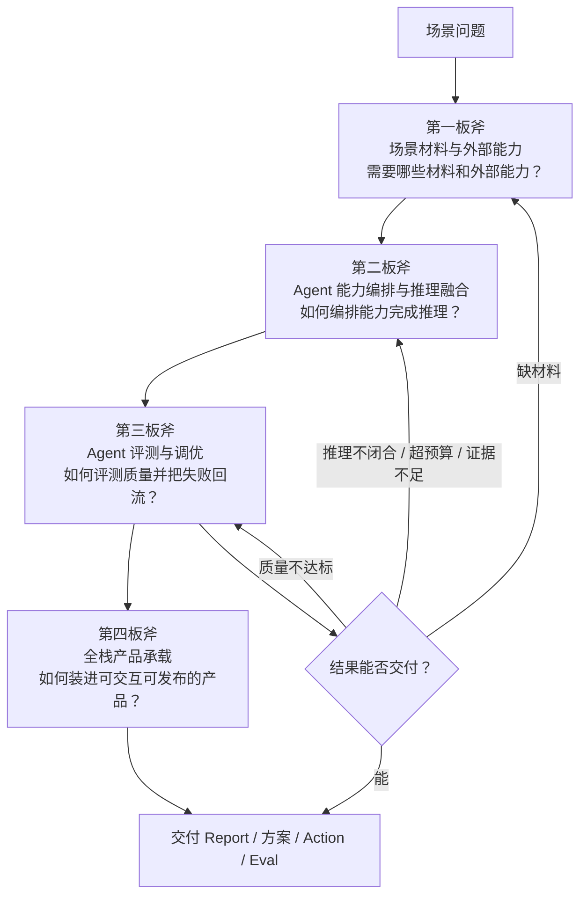
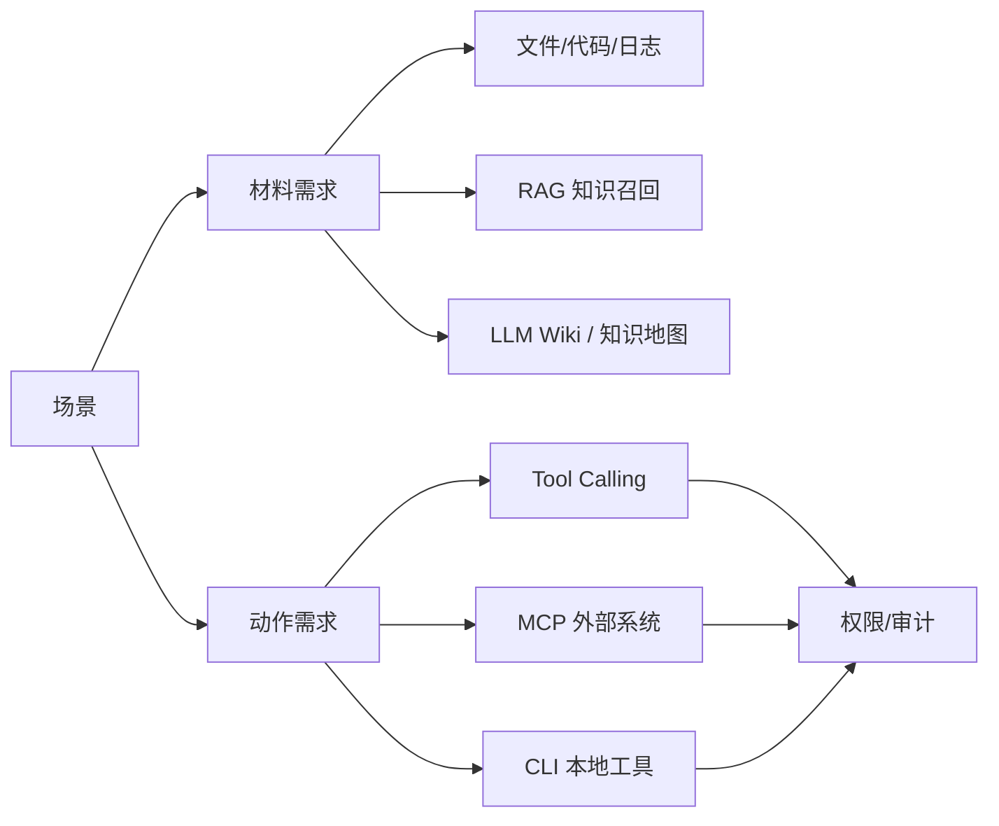
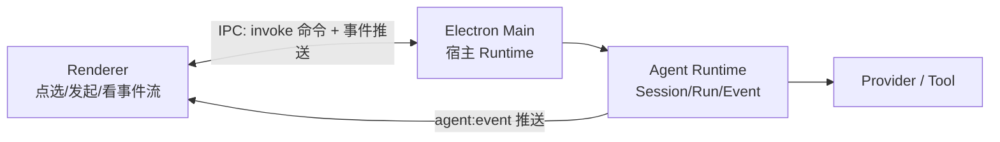

# 12-四板斧方法论速记

> 依据通用模板：`通用焚诀/04-方法论/01-AI项目三板斧方法论.md` 与 `学习文档/方法论/四板斧-通用Agent设计方法论.md`。
> 用途：面试前快速过一遍"如何推导一个 Agent 设计"，替代逐篇翻方法论原文。

---

## 0. 一句话总纲

设计 Agent 不从"接模型 / 选框架"开始，从**场景**开始。四板斧是四个连续问题：

> 先拆场景，再定材料；先定材料，再编排能力；先定义可交付标准，再让评测结论回流；需要交互与发布时，再定承载方式。

---

## 1. 第一板斧：场景材料与外部能力

**核心问题**：Agent 需要看到什么、调用什么、哪些事情不能直接做？

**三个动作 = 定材料 + 定能力 + 定边界**

| 设计判断 | 典型选择 |
|-|-|
| 什么信息必须进上下文？ | 文件、日志、代码、用户输入、当前任务状态 |
| 什么信息走 RAG 召回？ | SOP、历史案例、知识库、长文档 |
| 什么能力做成 Tool Calling？ | 结构化函数、API、计算、查询、读取 |
| 什么系统用 MCP 标准化接入？ | 企业系统、远程服务、跨客户端复用 |
| 什么动作走 CLI？ | 本地搜索、测试、Git、构建、批处理 |
| 哪些工具必须加权限/确认/审计？ | 写操作、删除、外发、生产变更、敏感数据 |

> **口诀**：MCP / CLI / RAG / Tool Calling 都不是 Agent 本身，它们只是 Agent 获取材料和执行动作的**入口**。

---

## 2. 第二板斧：Agent 能力编排与推理融合

**核心问题**：如何把一次模型调用变成能持续行动、观察、停止、恢复的 Agent 系统？

**先用单 Agent 跑通，再判断为什么跑不通——跑不通的原因，往往就是该上多 Agent 的信号。**

### 基石层：单 Agent 五个模块（及边界）

| 模块 | 解决的 | 边界（注意别越界） |
|-|-|-|
| Prompt | 当前任务怎么做、输出长啥样 | 不承载所有长期流程 |
| Agent Loop | 如何在工具反馈中持续推进 | 必须有停止条件和错误恢复 |
| Memory | 管理状态、历史和经验 | **≠ 聊天记录** |
| Skill | 这类任务以后稳定做 | **≠ 单个 Tool** |
| Tool | 执行原子动作 | **≠ 完整业务流程** |

### 多 Agent：什么时候升级

| 单 Agent 失效信号 | 推荐设计 |
|-|-|
| 上下文太长、注意力稀释 | 先试压缩（第三板斧），不行再拆 |
| 生成者自审流于形式 | Generator + Critic |
| 任务有可并行子任务 | Router + Worker |
| 不同子任务需不同权限 | 按角色隔离权限 |
| 需不同专长（检索+推理+校对） | 按专长分工 |
| 简单工具调用、单轮问答 | **不该上多 Agent** |

> **多 Agent 的价值**不是"多个模型一起想"，而是**角色、上下文、工具权限和责任边界的拆分**。
> **反过度设计**：搜索->读取->分析是 Loop 内的步骤，不是一个个独立 Agent。

---

## 3. 第三板斧：Agent 评测与调优

**核心问题**：Agent 为什么成功/失败？这次结果能否交付？下一轮改哪里？

### 五维 Eval（必须看 Trace，不能只看最后一段回答）

| 维度 | 问什么 |
|-|-|
| Outcome 结果 | 任务完成了吗？结果满足要求吗？ |
| Trajectory 过程 | 工具路径、轮次、中间过程合理吗？ |
| Evidence 证据 | 结论能回到来源 / Tool Result 吗？ |
| Safety 安全 | 越权、泄露、绕过确认、危险动作？ |
| Cost 成本 | Token / 工具次数 / 重试 / 延迟超预算？ |

### 失败回流闭环

| 评测问题 | 回流方向 | 修正动作 |
|-|-|-|
| 缺材料 | 第一板斧 | 补充读取、检索、工具调用 |
| 推理不闭合 | 第二板斧 | 重组推理链、调整 Prompt、调用 Skill |
| 证据不足 | 一 + 二 | 追溯来源、补证据、降低断言强度 |
| 权限风险 | 第一板斧·安全边界 | 阻断、降级、人工确认 |
| 格式不达标 | 输出契约 | 重新组织报告、结论、风险点 |

**审计 Agent（Critic / Auditor / Reviewer）的价值**：制造独立视角，避免生成者自己宣布完成。

### Token 成本（治理是第三板斧的事）

- 省 Token 的**技术手段**（压缩/裁剪/缓存/隔离）归第二板斧 Memory/Loop/Prompt
- **预算设定、成本可观测、成本审计、回归测试**是治理问题，归第三板斧
- 判断标准不是"越省越好"，而是**证据完整性与预算之间的平衡**

---

## 4. 第四板斧：全栈产品承载

**核心问题**：如何把 Agent Runtime 组织成可交互、可持久化、可调试、可打包、可发布的全栈应用？

前三板斧做完只有"库"：没有窗口、没有交互、没有安装包。用户拿到的不是 Runtime，而是**产品**。

**三件必做的事**：
1. **进程边界**：Renderer / IPC / Main / Runtime 四层，UI 只走 IPC 契约，SDK 类型不进 Renderer
2. **本地持久化**：Session/Run 恢复、崩溃不丢状态（停止/取消经 AbortSignal，崩溃后 Run 进 failed 而非永久 running）
3. **产品状态**：Loading / Empty / Partial / Stale / Error / Retry，UI 不能白屏、不能假完成（"诚实失败"信封）

**何时跳过**：纯 API、脚本或 Demo 不需要 Electron；要窗口、离线凭证、崩溃恢复才值得承载层。

---

## 5. 贯穿心法：每板斧都问"够不够"

> 够就用最简方案，不够才加复杂度。说不清"为什么需要这个模块"，大概率是过度设计。

- 没有外部材料需求 → 不强上 RAG
- 没有复杂分工 → 不强上多 Agent
- 流程已稳定重复 → 沉淀成 Skill，不每次临场推理
- 输出无法评测 → 算不上可靠的 Agent 交付

**遇到新场景的推导顺序（5 步）**：
1. **拆场景**：需要什么信息？什么动作？什么风险？
2. **第一板斧**：定材料（进上下文/RAG）+ 定能力（Tool/MCP/CLI）+ 定边界（权限/审计）
3. **第二板斧**：单 Agent 编排（Prompt+Loop+Memory+Skill+Tool）→ 够不够？不够再升级多 Agent
4. **第三板斧**：定交付标准（Eval/审计 Agent/Token 预算）→ 能否交付？不能则回流
5. **第四板斧**（按需）：需要交互/持久化/发布？定承载方式（进程边界/IPC 契约/产品状态）

---

## 6. 自测清单（8 问）

- [ ] 每个场景先拆"信息/动作/风险"再进四板斧
- [ ] 能分清 上下文 vs RAG vs Tool vs MCP vs CLI
- [ ] 能说清"为什么单 Agent 够/不够"，而非默认多 Agent
- [ ] 能设计审计和回流机制，而非只说"加个 Eval"
- [ ] 能指出哪些模块**不需要**
- [ ] 能识别过度设计（如给每个步骤起一个 Agent）
- [ ] Token 预算有具体数字思路，而非"尽量省"
- [ ] 承载层能说清 Renderer/Main/Runtime 边界，而非"套个壳"

---

## 7. 用自己两个项目对照记忆

| 板斧 | 多渠道获客数字员工平台（承接端） | 蓬蓬AI · 员工超级助手（生产端） |
|-|-|-|
| 一 · 材料 | 7 个 IM 渠道接入、身份归一 | 统一模型后端、MCP 工具接入 |
| 二 · 编排 | 四账本去重 + 串行队列 + Agent 执行 | Agent Runtime、AgentEvent 事件流 |
| 三 · 评测 | 上下文连续性、并发跟进质量 | 工具权限裁决（safe/ask/allow-all）= 安全边界 |
| 四 · 承载 | 出站投递 + 流式返回 | **Electron / Web 双端统一通信** |

**面试一句话**：先拆场景定材料，再编排推理闭环，评测失败记得回流，最后装成产品让用户能用。