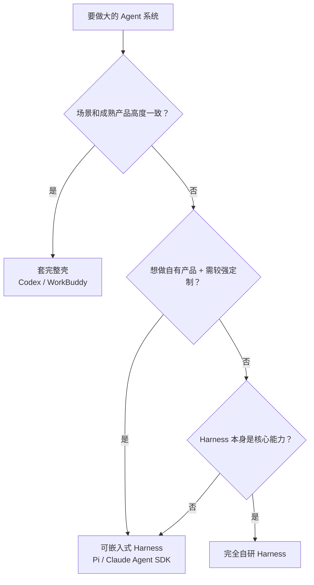

# 13-Agent 系统选型原则与我的演进

> 依据素材：微信图片（Agent 系统选型原则）+ `07-我的项目内参.md` 已核实的项目事实。
> 用途：面试被问「为什么用这个方案 / 项目怎么设计出来的」时，甩出选型原则 + 我的真实演进思考。
> 红线：口径不升格——底座是团队/开源底座，我做的是**应用端工程化**；演进过程只讲已核实的技术事实，不编造指标。

---

## 一、选型原则（速记卡）

做大的 Agent 系统，一般有三种方案：

| 方案 | 代表 | 自由度 | 开发成本/速度 | 成熟度 | 适用场景 |
|-|-|-|-|-|-|
| ① 完全自研 Harness | 自研 | 最高（Loop/上下文/Tool/Memory/恢复全自控） | 最高 / 最慢 | 需自行积累 | Harness 本身就是公司核心竞争力 |
| ② 套完整壳 | Codex、WorkBuddy | 受约束 | 最低 / 最快 | 高 | 场景与成熟产品高度一致 |
| ③ 可嵌入式 Harness | Pi、Claude Agent SDK | 中等（底层复用 + 上层自控） | 中等 | 底层高 | **自有产品 + 需要较强定制（折中最常见）** |

**要点**：
- "壳"不是 UI，而是 Agent 的工作方式、Session、工具体系、执行环境、产品交互都设计好的完整形态
- 第三类复用底层（Agent Loop、Tool Calling、上下文），自己控制上层（**产品、Runtime、权限、审批、业务 Tool、Workspace、审计**）
- 决策优先级：**场景匹配度 > 定制需求 > 是否核心能力**

> **一句话**：场景和成熟产品高度一致就套壳；想做自有产品还要定制，选 Pi/Agent SDK；只有 Harness 本身是核心能力，才完全自研。

---

## 二、我的演进思考（第一人称叙事）

> 面试话术骨架。先讲"原来的问题"，再讲"我怎么一步步改进到现在"，每一步技术点都挂业务问题。

### 背景一句话

我做的两个项目都是同一套底座（团队/开源 Runtime）上的 Agent 应用端：一个是多渠道获客数字员工平台（承接端），一个是 AI 营销内容生产助手（生产端）。我的工作其实就是在验证**第三类方案**——底层 Loop/工具调用复用，上层的接入、权限、事件、多端全是我们自己控制的。

### 演进 Step 1：渠道接入从"各接各的"到统一入口（承接端）

**原来的问题**：平台要接 7 个 IM 渠道（飞书、微信、Telegram……）。如果每个渠道都在业务代码里各写一套收发和格式转换，接入一个新渠道就要重写一遍；且消息来源、身份、上下文各渠道各管各的，混在一起。

**怎么改**（做应用端工程化时我在这一层做的事）：
- 建统一渠道接入层 + 身份归一，把"渠道"降级成适配器而不是业务逻辑本身
- 消息统一进四账本去重 + 串行队列，保证一条消息在并发追进下只被处理一次、上下文连续

**思考**：这件事本质上就是"外部能力入口"的设计——渠道是 Tool/入口，不是 Agent。选型时我倾向可嵌入式 Harness，就是因为这套上层控制（身份、去重、调度）必须握在自己手里，套完整壳反而拿不到。

### 演进 Step 2：从"换模型动前端"到统一模型后端（生产端）

**原来的问题**：前端直接绑到具体模型服务上，换一个模型就要改前端；多端（Electron / Web）各干各的，事件语义不一致，工具调用权限散落。

**怎么改**（生产端 Runtime 侧）：
- 统一模型后端：换模型不改前端，供应商变化收敛在边界里
- AgentEvent 事件流：Session/Run/Event 结构化推给双端，双端渲染一致
- 工具权限裁决（safe / ask / allow-all + 六步管线）：敏感操作硬拦截而非靠模型自觉
- 接入 MCP 让外部能力标准化

**思考**：这一步就是在搭"可嵌入式 Harness 的上层"——底层 Loop/Tool Calling 用成熟底座，**Runtime、权限、审批、业务工具、审计**全是我们自己的。这也回答了一个选型问题：为什么不是完全自研？因为 Loop/记忆这些成熟能力重复造没有收益，底座团队已经打磨好，我该做的事是让它在真实业务流程里稳、可控、可审计。

### 演进 Step 3：选型时刻——为什么不选另外两个

| 被否方案 | 否掉的理由（挂在业务上） |
|-|-|
| ① 完全自研 | Harness 不是我们团队/公司的核心竞争力；从零造 Loop、Memory、异常恢复，成本高、成熟度低，还比不上成熟底座——除非造它本身就是业务目标 |
| ② 套完整壳（Codex/WorkBuddy 类） | 壳把产品形态和执行模型定死了；我们的场景是 7 个 IM 承接、营销内容生产双端，和它原生场景不一致，强行套壳会约束交互和定制 |
| ③ 可嵌入式 Harness | **我最终所在的位置**：底层复用成熟能力，上层全自控，和"应用端工程化"的定位恰好吻合 |

**总结一句**：选了哪个方案不重要，重要的是**每一步都问"哪一层该复用、哪一层该自己控制"**——复用留给底座，控制留给业务边界。

---

## 三、面试怎么用

1. **被问选型/架构怎么定的**：先甩三条方案对比（一、二、三），再说"我实际站在第三条，理由有三……"（演进 Step 3）。
2. **被问"为什么不用现成的 Coding Agent / 壳"**：场景不一致 → 壳约束执行模型和产品形态 → 我要的是自有产品的权限、审计、多端控制。
3. **被问"你只做应用端，是不是没难度"**：承接演进 Step 2——应用端工程化的难点正是**上层控制**：身份归一、事件语义、权限硬拦截、多端一致，这些都握在我们手里，底座给不了。
4. **红线兜底**：被剥离集体功劳时，承认 Runtime 底座是团队/开源的，但要讲清楚"上层控制是我做的"——这正是第三类方案里"值得做"的那一半。

---

## 四、与四板斧方法论的关系

选型不是某一板斧，而是**进入四板斧之前的前置判断**：
- 选"自研/壳/嵌入式"决定了板斧一~三哪些层能复用、哪些层要自己搭
- 复用底层（Loop/Tool 调用）≈ 板斧二地基；自己控上层（权限/审计）≈ 板斧一边界 + 板斧三安全；多端承载 ≈ 板斧四

> 和 `12-四板斧方法论速记.md` 配合记忆：四板斧回答"怎么设计"，选型原则回答"用谁的地基、自己盖哪几层"。